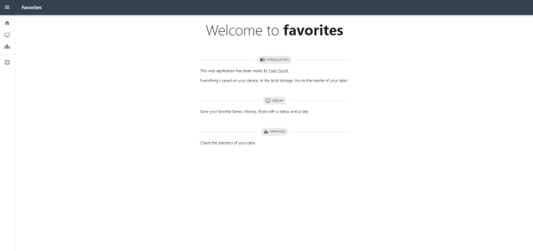
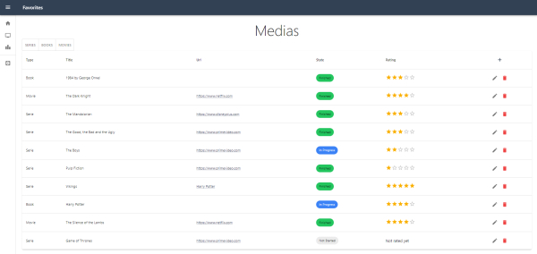
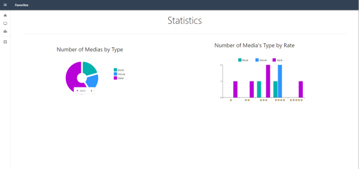

# My Next.js TypeScript App

Welcome to my application built with Next.js, TypeScript, and Material-UI components.

## Table of Contents

- [Getting Started](#getting-started)
- [Preview](#features)
- [Demo](#demo)

## Getting Started

To run this project locally, follow these steps:

1. Clone the repository to your local machine:

   ```bash
   git clone https://github.com/your-username/your-repo.git
   ```

2. Run it :

   ```bash
   npm run dev
   # or
   yarn dev
   # or
   pnpm dev
   # or
   bun dev
   ```

   Open [http://localhost:3000](http://localhost:3000) with your browser to see the result.

## Preview

This app features three main menus : [Home](#home) - [Medias](#medias) - [Statistics](#statistics)

### Home



The home menu serves as the main landing page for the application, providing an introduction to its features.

### Medias



In the 'Medias' menu, users can manage their media collection. This includes adding, deleting, and viewing various media types such as books, series, and movies.

### Statistics



The 'Statistics' menu offers users insightful charts and graphs based on the data they have inserted into the app.

## Demo

A demo of the latest version is displayed here : [Demo Made With Vercel](https://favorites-two.vercel.app/)
